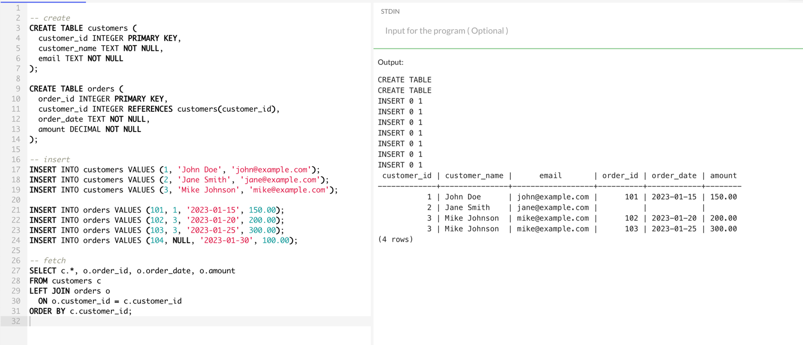
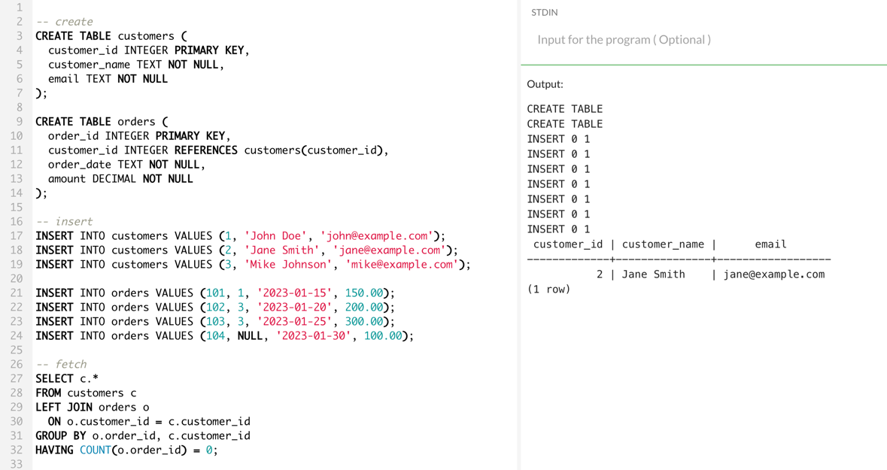
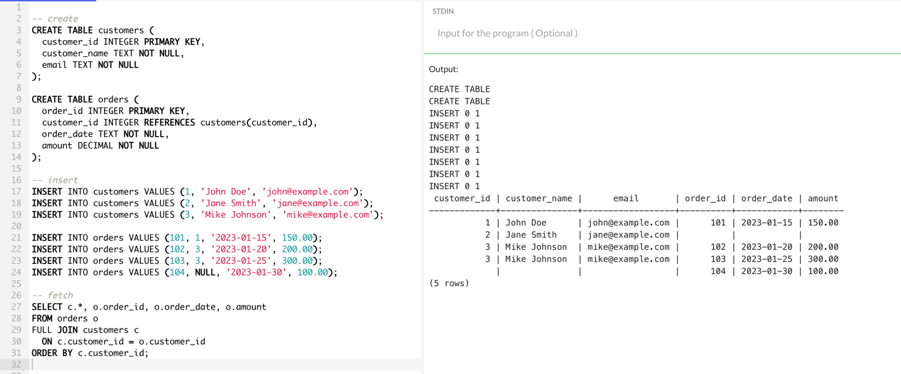
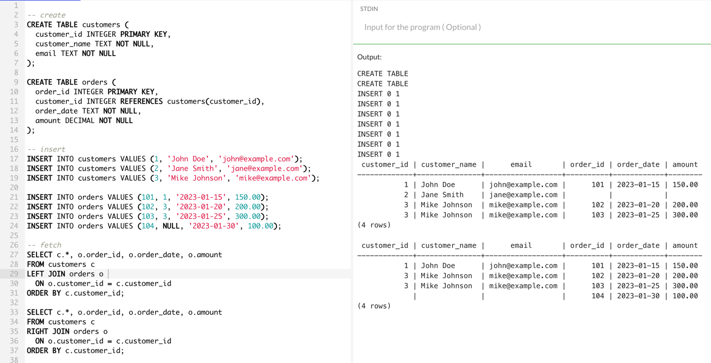

# tbc

## Обработка данных с использованием goroutine
**Описание:**

Вам нужно разработать программу на Go, которая будет выполнять параллельную обработку данных с использованием goroutine и каналов.\
Программа должна считывать данные из файла, обрабатывать их в нескольких goroutine и сохранять результаты в другой файл.

**Требования:**

Чтение данных:
>•	Программа должна считывать строки текста из входного файла input.txt.\
•	Предположим, что каждая строка содержит числовые данные, разделенные пробелами.

Обработка данных:
>•	Необходимо реализовать функцию для обработки данных. Например, функция может вычислять сумму чисел в каждой строке.\
•	Обработка каждой строки должна выполняться в отдельной goroutine.

Использование каналов:
>•	Используйте каналы для передачи данных между goroutine.\
•	Один канал для передачи строк из файла в goroutine.\
•	Другой канал для передачи результатов обработки обратно в основную горутину.

Сохранение данных:
>•	Результаты обработки должны быть сохранены в выходной файл output.txt.\
•	Каждая строка в output.txt должна соответствовать строке в input.txt и содержать результат обработки (например, сумму чисел).

Пример входных данных (input.txt)

1 2 3\
4 5 6\
7 8 9

Пример выходных данных (output.txt)

6\
15\
24

**Указания**

>•	Используйте стандартную библиотеку Go.
•	Обратите внимание на обработку ошибок.
•	Обеспечьте корректное закрытие каналов.
•	Программа должна корректно завершаться после обработки всех данных.

**Проверка**
>•	Убедитесь, что программа корректно обрабатывает входные данные и записывает результаты в выходной файл.
•	Протестируйте программу с различными наборами данных, включая пустые строки и строки с некорректными данными.

## SQL

**Описание задачи:**

У вас есть две таблицы в базе данных:

customers (таблица с информацией о клиентах):\
>•	customer_id (INT) - уникальный идентификатор клиента\
•	customer_name (VARCHAR) - имя клиента\
•	email (VARCHAR) - электронная почта клиента

orders (таблица с информацией о заказах):
>•	order_id (INT) - уникальный идентификатор заказа\
•	customer_id (INT) - идентификатор клиента, который сделал заказ\
•	order_date (DATE) - дата заказа\
•	amount (DECIMAL) - сумма заказа

**Задачи:**

1) Получение списка всех клиентов и их заказов: Напишите SQL-запрос, который возвращает список всех клиентов и их заказов.\
Если у клиента нет заказов, информация о клиенте все равно должна отображаться, а поля, относящиеся к заказам, должны содержать NULL.

2) Получение списка клиентов, которые не делали заказов: Напишите SQL-запрос, который возвращает список клиентов, которые не делали никаких заказов.

3) Получение списка всех клиентов и их заказов, включая заказы без клиентов (RIGHT JOIN):  <------- **Я не знаю как RIGHT JOIN-ом вытащить данные из обеих таблиц. Поэтому использовала FULL**\
   Напишите SQL-запрос, который возвращает список всех клиентов и их заказов, включая заказы, которые не привязаны к существующим клиентам.\
   В этом случае, информация о таких заказах все равно должна отображаться, а поля, относящиеся к клиентам, должны содержать NULL

4) Поясните каждую строку вашего кода и объясните, как работают LEFT JOIN и RIGHT JOIN в каждом случае

**LEFT JOIN** - тащит все данные из левой таблицы и тащит данные из правой таблицы, если нашлись совпадения
**RIGHT JOIN** - тащит все данные из правой таблицы и тащит данные из левой таблицы, если нашлись совпадения

Из скрина можно увидеть, что:
1) в первом случае при LEFT JOIN левой таблицей считается customers. Поэтому из него вытащились все данные, а с правой(orders) только те, у которых нашлись связи
2) во втором случае при RIGHT JOIN правой таблицей считается orders. Поэтому из него вытащились все данные, а с левой(customers) только те, у которых нашлись связи
